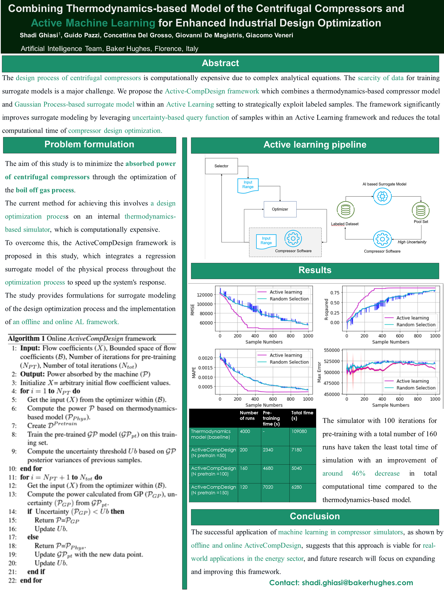
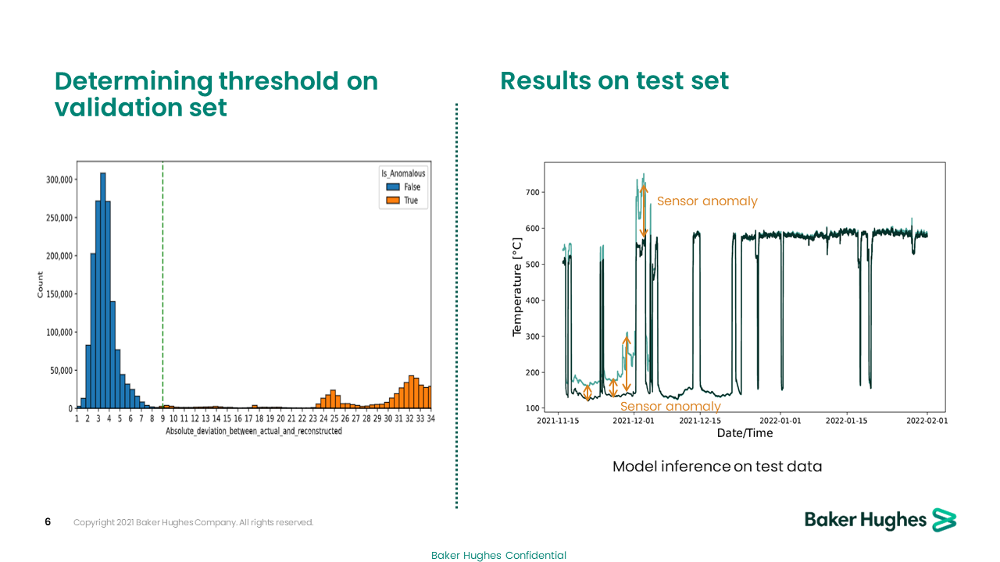
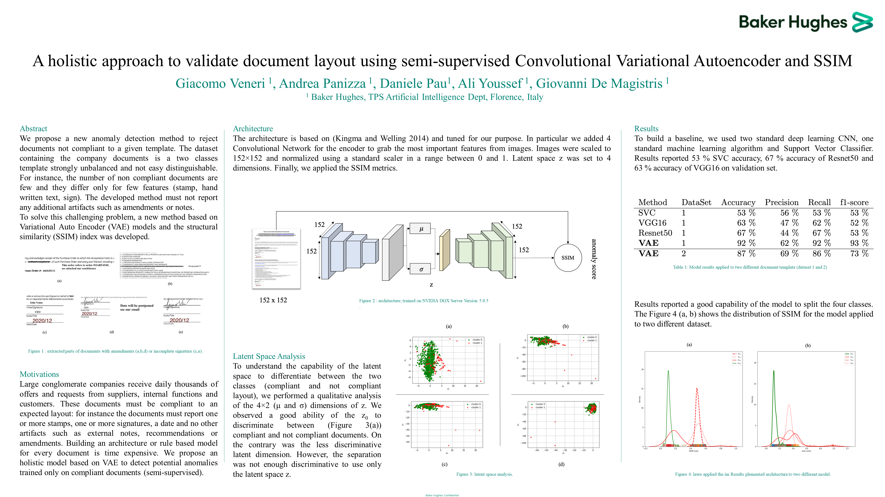
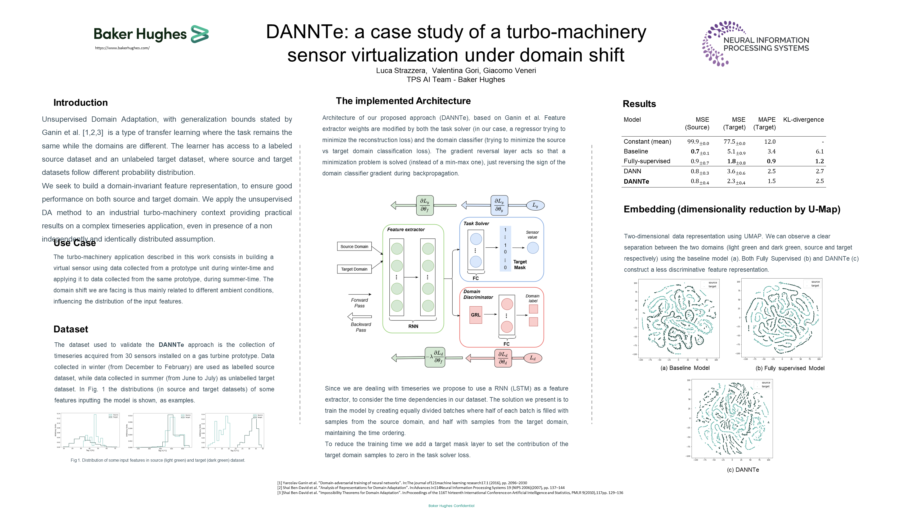

# papers
Paper presentation, poster and material published

 ## Controllable Image Synthesis of Industrial Data Using Stable Diffusion - Gabriele Valvano, Antonino Agostino, Giovanni De Magistris, Antonino Graziano, Giacomo Veneri - 2024 - Proceedings of the IEEE/CVF Winter Conference on Applications of Computer Vision 
 
 [link](https://openaccess.thecvf.com/content/WACV2024/papers/Valvano_Controllable_Image_Synthesis_of_Industrial_Data_Using_Stable_Diffusion_WACV_2024_paper.pdf)
 [material](https://github.com/AILAB-bh/papers/releases/tag/1.2)


Training supervised deep neural networks that perform defect detection and segmentation requires large-scale
fully-annotated datasets, which can be hard or even impossible to obtain in industrial environments. Generative AI
offers opportunities to enlarge small industrial datasets artificially, thus enabling the usage of state-of-the-art supervised approaches in the industry. Unfortunately, also good
generative models need a lot of data to train, while industrial datasets are often tiny. Here, we propose a new approach for reusing general-purpose pre-trained generative
models on industrial data, ultimately allowing the generation of self-labelled defective images. First, we let the model
learn the new concept, entailing the novel data distribution.
Then, we force it to learn to condition the generative process, producing industrial images that satisfy well-defined
topological characteristics and show defects with a given
geometry and location. To highlight the advantage of our
approach, we use the synthetic dataset to optimise a crack
segmentor for a real industrial use case. When the available data is small, we observe considerable performance
increase under several metrics, showing the method’s potential in production environments.


```
 @InProceedings{Valvano_2024_WACV,
    author    = {Valvano, Gabriele and Agostino, Antonino and De Magistris, Giovanni and Graziano, Antonino and Veneri, Giacomo},
    title     = {Controllable Image Synthesis of Industrial Data Using Stable Diffusion},
    booktitle = {Proceedings of the IEEE/CVF Winter Conference on Applications of Computer Vision (WACV)},
    month     = {January},
    year      = {2024},
    pages     = {5354-5363}
}
```
 
 ## Combining Thermodynamics-based Model of the Centrifugal Compressors and Active Machine Learning for Enhanced Industrial Design Optimization - S Ghiasi, G Pazzi, C Del Grosso, G De Magistris, G Veneri - 1st workshop on Synergy of Scientific and Machine Learning Modeling, SynS - 2023 
 
 [link](https://openreview.net/pdf?id=bZ5br8JcTS)



The design process of centrifugal compressors requires applying an optimization process which is computationally expensive due to complex analytical equations underlying the compressor's dynamical equations. Although the regression surrogate models could drastically reduce the computational cost of such a process, the major challenge is the scarcity of data for training the surrogate model. Aiming to strategically exploit the labeled samples, we propose the Active-CompDesign framework in which we combine a thermodynamics-based compressor model (i.e., our internal software for compressor design) and Gaussian Process-based surrogate model within a deployable Active Learning (AL) setting. We first conduct experiments in an offline setting and further, extend it to an online AL framework where a real-time interaction with the thermodynamics-based compressor's model allows the deployment in production. ActiveCompDesign shows a significant performance improvement in surrogate modeling by leveraging on uncertainty-based query function of samples within the AL framework with respect to the random selection of data points. Moreover, our framework in production has reduced the total computational time of compressor's design optimization to around 46% faster than relying on the internal thermodynamics-based simulator, achieving the same performance.
 
```
@inproceedings{Ghiasi_2023_ICML,
author = {Ghiasi, Shadi and Pazzi, Guido and Grosso, Concettina and Magistris, Giovanni and Veneri, Giacomo},
year = {2023},
month = {07},
pages = {},
title = {Combining Thermodynamics-based Model of the Centrifugal Compressors and Active Machine Learning for Enhanced Industrial Design Optimization},
booktitle = {1st workshop on Synergy of Scientific and Machine Learning Modeling, SynS & ML (ICML)}
}
```
 
 ## Sensor virtualization for anomaly detection of turbo-machinery sensors - An industrial application - S Shetty, V Gori, G Veneri - 9th International conference on Time Series and Forecasting - ITISE2023        2023 
 
 [link](https://www.mdpi.com/2673-4591/39/1/96)
 
 
 We apply a Granger causality and auto-correlation analysis to train a recurrent neural network (RNN) that acts as a virtual sensor model. These models can be used to check the status of several hundreds of sensors during turbo-machinery units’ operation. Checking the health of each sensor is a time-consuming activity. Training a supervised algorithm is not feasible because we do not know all the failure modes that the sensors can undergo. We use a semi-supervised approach and train an RNN (LSTM) on non-anomalous data to build a virtual sensor using other sensors as regressors. We use the Granger causality test to identify the set of input sensors for a given target sensor. Moreover, we look at the auto-correlation function (ACF) to understand the temporal dependency in data. We then compare the predicted signal vs. the real one to raise (in case) an anomaly in real time. Results report 96% precision and 100% recall.
 ```
 @Article{Shetty_2023_ITISE,
AUTHOR = {Shetty, Sachin and Gori, Valentina and Bagni, Gianni and Veneri, Giacomo},
TITLE = {Sensor Virtualization for Anomaly Detection of Turbo-Machinery Sensors&mdash;An Industrial Application},
JOURNAL = {Proceedings of The 9th International Conference on Time Series and Forecasting},
VOLUME = {39},
YEAR = {2023},
NUMBER = {1},
ARTICLE-NUMBER = {96},
URL = {https://www.mdpi.com/2673-4591/39/1/96},
ISSN = {2673-4591},
ABSTRACT = {We apply a Granger causality and auto-correlation analysis to train a recurrent neural network (RNN) that acts as a virtual sensor model. These models can be used to check the status of several hundreds of sensors during turbo-machinery units&rsquo; operation. Checking the health of each sensor is a time-consuming activity. Training a supervised algorithm is not feasible because we do not know all the failure modes that the sensors can undergo. We use a semi-supervised approach and train an RNN (LSTM) on non-anomalous data to build a virtual sensor using other sensors as regressors. We use the Granger causality test to identify the set of input sensors for a given target sensor. Moreover, we look at the auto-correlation function (ACF) to understand the temporal dependency in data. We then compare the predicted signal vs. the real one to raise (in case) an anomaly in real time. Results report 96% precision and 100% recall.},
DOI = {10.3390/engproc2023039096}
}
 ```


## Document Layout Analysis with Variational Autoencoders: An Industrial Application - A Youssef, G Valvano, G Veneri - ISMIS 2022. Lecture Notes in Computer Science 13515        2022 

[link](https://link.springer.com/chapter/10.1007/978-3-031-16564-1_46)



We present a novel method for Document Layout Analysis that detects documents that are not compliant with a given template. The major challenge we solve is dealing with a highly unbalanced dataset with only a few, hard-to-distinguish, non-compliant documents. Our model learns to detect inadequate documents based on localised non-compliant characteristics, including stamps, handwritten text, and misplaced signatures. Nevertheless, the model must not report documents containing other artefacts such as amendments or notes, which we deem acceptable. We address these challenges via generative modelling, using anomaly detection techniques to validate document layout. In particular, we first let the model learn the compliant document distribution. Then, we detect and report out-of-distribution samples for their automated rejection. In the paper, we investigate and compare two major approaches to anomaly detection: 1) classifying anomalies as those samples that cannot be accurately generated by the model; and 2) detecting samples whose mapping to a known proxy distribution is not possible. Both methods can be trained without annotations and obtain a classification accuracy of 
90% on real-world documents, outperforming alternative supervised solutions.

 ```
@InProceedings{Youssef_2022,
author="Youssef, Ali
and Valvano, Gabriele
and Veneri, Giacomo",
editor="Ceci, Michelangelo
and Flesca, Sergio
and Masciari, Elio
and Manco, Giuseppe
and Ra{\'{s}}, Zbigniew W.",
title="Document Layout Analysis with Variational Autoencoders: An Industrial Application",
booktitle="Foundations of Intelligent Systems",
year="2022",
publisher="Springer International Publishing",
address="Cham",
pages="477--486",
abstract="We present a novel method for Document Layout Analysis that detects documents that are not compliant with a given template. The major challenge we solve is dealing with a highly unbalanced dataset with only a few, hard-to-distinguish, non-compliant documents. Our model learns to detect inadequate documents based on localised non-compliant characteristics, including stamps, handwritten text, and misplaced signatures. Nevertheless, the model must not report documents containing other artefacts such as amendments or notes, which we deem acceptable. We address these challenges via generative modelling, using anomaly detection techniques to validate document layout. In particular, we first let the model learn the compliant document distribution. Then, we detect and report out-of-distribution samples for their automated rejection. In the paper, we investigate and compare two major approaches to anomaly detection: 1) classifying anomalies as those samples that cannot be accurately generated by the model; and 2) detecting samples whose mapping to a known proxy distribution is not possible. Both methods can be trained without annotations and obtain a classification accuracy of {\$}{\$}{\backslash}sim {\$}{\$}∼90{\%} on real-world documents, outperforming alternative supervised solutions.",
isbn="978-3-031-16564-1"
}
 ```

## Continual Learning for anomaly detection on turbomachinery prototypes - A real application - V Gori, G Veneri, V Ballarini - 2022 IEEE Congress on Evolutionary Computation (CEC), 2022, 1-7    2    2022 

[link](https://ieeexplore.ieee.org/abstract/document/9870234/)

We apply a Recurrent Neural Network (RNN), Kullback-Leibler (KL) divergence and a continual learning approach to check the status of several hundreds of sensors during turbo-machinery prototype testing. Turbo-machinery prototypes can be instrumented with up to thousands of sensors. Therefore, checking the health of each sensor is a time consuming activity. Prototypes are also tested on several different and a-priori unknown operating conditions, so we cannot apply a purely supervised model to detect potential anomalies of sensors and, moreover, we have to take into account a covariate shift because measurements drift continuously day by day. We continuously train a RNN (daily) to build a virtual sensor from other sensors and we compare the predicted signal vs the real signal to raise (in case) an anomaly. Furthermore, KL is used to estimate the overlap between the input distributions available at training time and the ones seen at test time, and thus the confidence level of the prediction. Finally we implement an end-to-end system to automatically train and evaluate the models. The paper presents the system and reports the application to a test campaign of about five hundred sensors.

 ```
@INPROCEEDINGS{Gori_2022_CEC,
  author={Gori, Valentina and Veneri, Giacomo and Ballarini, Valeria},
  booktitle={2022 IEEE Congress on Evolutionary Computation (CEC)}, 
  title={Continual Learning for anomaly detection on turbomachinery prototypes - A real application}, 
  year={2022},
  volume={},
  number={},
  pages={1-7},
  doi={10.1109/CEC55065.2022.9870234}}
   ```

## Deep Surrogate of Modular Multi Pump using Active Learning - M Murugesan, K Goyal, L Barriere, M Pasquotti, G Veneri, G De Magistris - Adaptive Experimental Design and Active Learning in the Real World - ICML 2022    1    2022 

[link](https://syns-ml.github.io/2023/assets/papers/24.pdf) - [arxiv](https://arxiv.org/pdf/2208.02840.pdf)
Due to the high cost and reliability of sensors, the designers of a pump reduce the needed number of sensors for the estimation of the feasible operating point as much as possible. The major challenge to obtain a good estimation is the low amount of data available. Using this amount of data, the performance of the estimation method is not enough to satisfy the client requests. To solve this problem of scarcity of data, getting high quality data is important to obtain a good estimation. Based on these considerations, we develop an active learning framework for estimating the operating point of a Modular Multi Pump used in energy field. In particular we focus on the estimation of the surge distance. We apply Active learning to estimate the surge distance with minimal dataset. Results report that active learning is a valuable technique also for real application.

 ```
@article{Murugesan_2022_ICML,
  title={Deep Surrogate of Modular Multi Pump using Active Learning},
  author={Murugesan, Malathi and Goyal, Kanika and Barriere, Laure and Pasquotti, Maura and Veneri, Giacomo and De Magistris, Giovanni},
  year = {2022},
booktitle = {Workshop on Adaptive Experimental Design and Active Learning in the Real World (ICML2022)}
}
 ```

## DANNTe: a case study of a turbo-machinery sensor virtualization under domain shift - L Strazzera, V Gori, G Veneri - Distribution shifts: connecting methods and applications (DistShift) - NEURIPS    2    2021 

[arxiv](https://arxiv.org/pdf/2201.03850.pdf)


We propose an adversarial learning method to tackle a Domain Adaptation (DA) time series regression task (DANNTe). The regression aims at building a virtual copy of a sensor installed on a gas turbine, to be used in place of the physical sensor which can be missing in certain situations. Our DA approach is to search for a domain-invariant representation of the features. The learner has access to both a labelled source dataset and an unlabeled target dataset (unsupervised DA) and is trained on both, exploiting the minmax game between a task regressor and a domain classifier Neural Networks. Both models share the same feature representation, learnt by a feature extractor. This work is based on the results published by Ganin et al. arXiv:1505.07818; indeed, we present an extension suitable to time series applications. We report a significant improvement in regression performance, compared to the baseline model trained on the source domain only.

 ```
@inproceedings{Strazzera_2021_NEURIPS,
title={{DANNT}e: a case study of a turbo-machinery sensor virtualization under domain shift},
author={Luca Strazzera and Valentina Gori and Giacomo Veneri},
booktitle={NeurIPS 2021 Workshop on Distribution Shifts: Connecting Methods and Applications},
year={2021},
url={https://openreview.net/forum?id=zHVg1w2Fh8O}
}
 ```

## Learning to Identify Drilling Defects in Turbine Blades with Single Stage Detectors - A Panizza, ST Stefanek, S Melacci, G Veneri, M Gori - Machine Learning for Engineering Modeling, Simulation, and Design Workshop 2020 

[arxiv](https://arxiv.org/pdf/2208.04363.pdf)


Nondestructive testing (NDT) is widely applied to defect identification of turbine components during manufacturing and operation. Operational efficiency is key for gas turbine OEM (Original Equipment Manufacturers). Automating the inspection process as much as possible, while minimizing the uncertainties involved, is thus crucial. We propose a model based on RetinaNet to identify drilling defects in X-ray images of turbine blades. The application is challenging due to the large image resolutions in which defects are very small and hardly captured by the commonly used anchor sizes, and also due to the small size of the available dataset. As a matter of fact, all these issues are pretty common in the application of Deep Learning-based object detection models to industrial defect data. We overcome such issues using open source models, splitting the input images into tiles and scaling them up, applying heavy data augmentation, and optimizing the anchor size and aspect ratios with a differential evolution solver. We validate the model with 3-fold cross-validation, showing a very high accuracy in identifying images with defects. We also define a set of best practices which can help other practitioners overcome similar challenges.

 ```
@misc{Panizza_2020_NEURIPS,
      title={Learning to Identify Drilling Defects in Turbine Blades with Single Stage Detectors}, 
      author={Andrea Panizza and Szymon Tomasz Stefanek and Stefano Melacci and Giacomo Veneri and Marco Gori},
      year={2020},
	  booktitle={Machine Learning for Engineering Modeling, Simulation, and Design Workshop (NEURIPS)}
}
 ```
